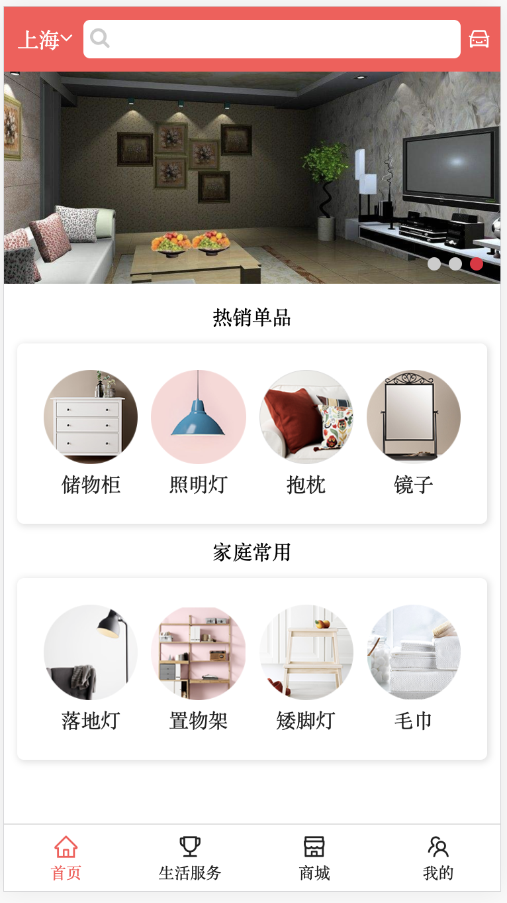
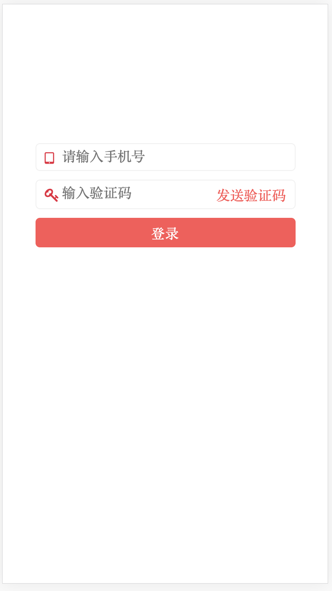
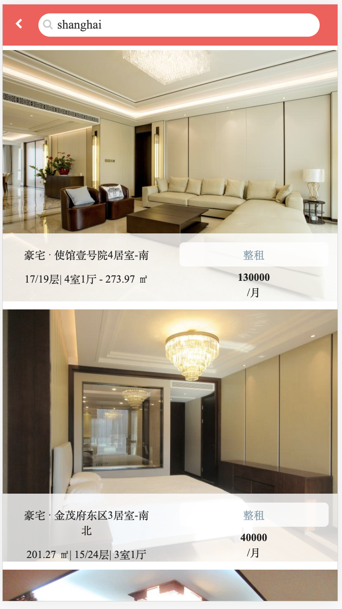

# 宜居(移动端页面、基于React框架)
项目描述:
        这是一款搜索房源及租房购房的网站,​用户可通过搜索城市、登陆来进行房屋的租赁及购买,还可进行收藏等功能.  
        该项目主要运用react框架,搭配react-router、swiper、antd等组件及组件库进行实现.
​
项目职责:
1.实行react框架的基础搭建,完成react-router的基础路由搭建.
2.运用swiper进行项目中轮播图功能的实现.
3.使用redux以及mysql搭建服务器存储用户信息,实现登陆功能.
4.利用路由参数传递方式,实现react-router的路由跳转功能及高亮效果,城市搜索匹配功能,并设置二级路由搭建.
5.利用redux实现房源信息收藏的记录功能.
6.使用rem布局,进行移动端页面的适配.
7.通过本地存储判断用户的登陆状态

